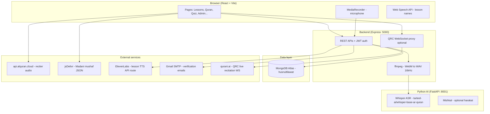

# Husn-ul-Tilawat — Viva & Secondary Defense Preparation Guide

**Project title:** Husn-ul-Tilawat — AI-Based Web Learning Platform for Quranic Recitation (Tajweed)  
**Repository structure:** Monorepo with three main parts: `frontend/`, `backend/`, `python-ai/`

Use this document to answer your examiner about **what** the system does, **how** it is built, **where** data comes from, and **why** each technology was chosen.

---

## 1. Executive Summary (30-second pitch)

Husn-ul-Tilawat is a full-stack web application that helps learners study **Tajweed lessons**, practice **pronunciation**, take **quizzes**, read the **Quran (Madani mushaf layout)**, and check **live recitation** using **speech recognition**. Users register with **email verification**, progress is stored in **MongoDB Atlas**, and **AI speech-to-text** (Whisper fine-tuned for Quranic Arabic) compares what the user recited against the expected Arabic text.

---

## 2. System Architecture



**Request flow for recitation check (Lessons / Pronunciation / Quran practice):**

1. User records audio in the browser (`useAudioRecorder` → WebM blob).  
2. Frontend `POST /api/check-recitation` (multipart: `audio`, `mode`, `expected`).  
3. Backend converts audio to **16 kHz mono WAV** with **ffmpeg**.  
4. Backend calls **Python** `POST {PYTHON_AI_URL}/transcribe`.  
5. Backend compares transcript to `expected` using **Levenshtein similarity** on **plain Arabic** (diacritics stripped).  
6. JSON result returned (`passed`, `similarity`, `spokenWord`, etc.).  
7. Optional: frontend saves progress (`/api/lessons/practice-pass`) or recitation history.

---

## 3. Technology Stack

| Layer | Technology | Purpose |
|--------|------------|---------|
| **Frontend** | React 18, TypeScript, Vite 8 | SPA UI, fast dev server on port **8080** |
| **UI** | Tailwind CSS, shadcn/ui (Radix), Framer Motion | Accessible components, animations |
| **Routing** | React Router v6 | Public, protected, and admin routes |
| **HTTP client** | Axios, `fetch` | Calls own backend; direct calls to Al Quran Cloud & CDN |
| **State / data** | React hooks, TanStack React Query | Server state where used |
| **Backend** | Node.js, Express 4 | REST API, file upload, WebSocket proxy |
| **Database** | MongoDB + Mongoose 8 | Persistent users, lessons, quizzes, feedback |
| **Auth** | JWT (jsonwebtoken), bcrypt | Login sessions; passwords hashed |
| **Email** | Nodemailer + Gmail SMTP | Verification & password reset codes |
| **Audio processing** | fluent-ffmpeg, ffmpeg-static | Convert browser WebM to WAV for ASR |
| **AI service** | Python FastAPI, Hugging Face Transformers | Quranic Arabic ASR |
| **ASR model** | `tarteel-ai/whisper-base-ar-quran` | Speech → Arabic text |
| **Optional diacritics** | Mishkal (`mishkal` Python lib) | Add harakat to raw transcript |
| **Dev proxy** | Vite proxy `/api` → `127.0.0.1:5000` | Avoid CORS in development |

---

## 4. Project Folder Structure

```
husnul-tilawat/
├── frontend/          # React UI (port 8080)
│   └── src/
│       ├── pages/     # Lessons, Quran, Quizzes, Auth, Admin...
│       ├── hooks/     # useAudioRecorder, useSpeechRecognition (legacy)
│       ├── data/      # Static Arabic grammar content
│       └── lib/       # Mushaf loader, Arabic compare helpers
├── backend/           # Express API (port 5000)
│   ├── models/        # Mongoose schemas
│   ├── routes/        # REST endpoints
│   ├── middleware/    # JWT protect
│   ├── utils/         # mail, transcribeAudio, plainArabic
│   └── qrcWebSocket.js # Qurani live recitation proxy
└── python-ai/         # FastAPI ASR (port 8001)
    └── main.py        # /transcribe, /health
```

---

## 5. Data Sources: Raw vs Database vs External API

This is a common viva question. Use the table below.

| Data | Source type | Where stored / loaded from | Used in |
|------|-------------|----------------------------|---------|
| **User accounts, passwords, roles** | Database (MongoDB) | `User` collection | Auth, admin |
| **Tajweed lessons** (title, Arabic with harakat, plain text, audio URL, order) | Database | `Lesson` collection — **admin creates/edits** | Lessons page, quizzes |
| **Practice phrases** | Database | `PracticePhrase` collection | Pronunciation page |
| **Quiz questions & options** | Database | `QuizQuestion` collection | Quizzes |
| **Quiz attempts & scores** | Database | `QuizResult` collection | Progress, admin |
| **User feedback** | Database | `Feedback` collection | Landing testimonials, admin |
| **Recitation history** | Database | `Recitation` collection | Admin recitations view |
| **Lesson practice unlocks** | Database | `User.practicePassedLessonIds` | Sequential lesson unlock |
| **Arabic grammar lessons** | **Static / raw in code** | `frontend/src/data/arabicGrammarReference.ts` | Arabic Grammar page — no API |
| **Madani mushaf (604 pages, verse text)** | **External JSON (cached in browser)** | `https://cdn.jsdelivr.net/gh/hamzakat/madani-muhsaf-json@main/madani-muhsaf.json` | Quran reader UI |
| **Quran reciter audio (per ayah)** | **External API** | `https://api.alquran.cloud/v1/ayah/{surah}:{ayah}/{edition}` | Quran page play button |
| **Speech transcription** | **External AI (your Python service)** | `POST {PYTHON_AI_URL}/transcribe` | All recitation checks |
| **Lesson TTS (optional)** | **External API** | ElevenLabs via backend `POST /api/lesson-tts` | Available on backend; lessons UI may use Web Speech API + `audioUrl` |
| **Email verification codes** | Generated server-side, stored hashed in DB | User document fields | Register / reset |
| **JWT token** | Generated server-side | Client `localStorage` | Protected routes |

**Important distinction for the examiner:**

- **“Raw data”** in this project usually means **static TypeScript/JSON files** shipped with the frontend (grammar topics, mushaf JSON from CDN) — not entered through admin panels.  
- **“Dynamic data”** is **MongoDB** content managed by admins (lessons, quizzes, phrases).  
- **“External API data”** is fetched at runtime from **Al Quran Cloud**, **jsDelivr**, **ElevenLabs**, **Gmail SMTP**, and **python-ai**.

---

## 6. MongoDB Collections (Database Schema Summary)

| Model | Main fields | Purpose |
|-------|-------------|---------|
| **User** | name, email, password (hashed), role (`user`/`admin`), emailVerified, verification/reset code hashes, `practicePassedLessonIds[]` | Authentication & lesson unlock progress |
| **Lesson** | title, slug, arabicText (with harakat), arabicTextForComparison (plain), translation, audioUrl, order, level, isActive | Tajweed curriculum |
| **PracticePhrase** | label, text, textForComparison, category, level, order | Pronunciation drills |
| **QuizQuestion** | lessonId, questionText, options[], correctIndex | Per-lesson MCQ |
| **QuizResult** | user, lessonId, score, answers | Quiz history & progress stats |
| **Feedback** | user, rating, message | User testimonials |
| **Recitation** | user, lesson/phrase ref, referenceText, recognizedText | Log of ASR outcomes |

**Database name:** `husnultilawat` (set via Mongoose `dbName` when Atlas URI has no database path).

---

## 7. Internal REST API Reference (Your Backend)

Base URL in development: `http://127.0.0.1:5000` (frontend uses `/api` proxy).

### 7.1 Authentication — `/api/auth`

| Method | Endpoint | Auth | Description |
|--------|----------|------|-------------|
| POST | `/register` | No | Create user, send email verification code |
| POST | `/verify-email` | No | Verify code → returns JWT |
| POST | `/resend-verification` | No | Resend code (cooldown) |
| POST | `/login` | No | Login (requires verified email) → JWT |
| POST | `/forgot-password` | No | Send reset code by email |
| POST | `/reset-password` | No | Reset password with code |

### 7.2 Profile — `/api/profile`

| Method | Endpoint | Auth | Description |
|--------|----------|------|-------------|
| GET | `/me` | JWT | Current user profile |

### 7.3 Lessons — `/api/lessons`

| Method | Endpoint | Auth | Description |
|--------|----------|------|-------------|
| GET | `/` | JWT | List active lessons (sorted by `order`) |
| GET | `/:id` | JWT | Single lesson |
| GET | `/progress/me` | JWT | IDs of lessons passed in practice |
| POST | `/practice-pass` | JWT | Record pass if score ≥ 70% & previous lessons done |
| POST, PUT, DELETE | `/` … | JWT + admin | CRUD (admin role on non-admin routes) |

### 7.4 Recitation check — `/api/check-recitation`

| Method | Endpoint | Auth | Body | Description |
|--------|----------|------|------|-------------|
| POST | `/check-recitation` | JWT | multipart: `audio`, `mode`, `expected` | ASR + compare |

**Modes:**

- `lesson` — single letter/word; pass if similarity ≥ **60%**  
- `pronunciation` — same comparison for practice phrases  
- `quran` — word-by-word accuracy across ayah; returns `wordResults`, `accuracy`

### 7.5 Other learner APIs

| Prefix | Key endpoints |
|--------|----------------|
| `/api/practice-phrases` | GET `/` — active phrases |
| `/api/quiz` | GET `/questions?lessonId=`, POST `/submit`, GET `/history` |
| `/api/progress` | GET `/overview` — dashboard stats, 7-day activity, streak |
| `/api/feedback` | POST `/` (auth), GET `/` (public list for landing) |
| `/api/recitations` | POST `/`, GET `/me` |
| `/api/lesson-tts` | POST `/` — ElevenLabs MP3 stream |

### 7.6 Admin — `/api/admin` (JWT + admin role)

Stats, users CRUD, feedback delete, lessons/phrases/quiz CRUD, recitations list.

### 7.7 WebSocket (optional)

| URL | Purpose |
|-----|---------|
| `ws://localhost:5000/api/qrc-stream` | Proxies browser audio to **Qurani QRC** (`wss://api.qurani.ai`) for real-time live recitation (Opus encoding on server). Infrastructure exists; Quran page currently uses batch `check-recitation` for tilawat check. |

---

## 8. External APIs & Services

| Service | URL / endpoint | API key? | Used for | Reference |
|---------|----------------|----------|----------|-----------|
| **MongoDB Atlas** | `mongodb+srv://...` | Yes (connection string) | All persistent app data | [MongoDB Atlas](https://www.mongodb.com/atlas) |
| **Al Quran Cloud** | `GET https://api.alquran.cloud/v1/ayah/{surah}:{ayah}/{edition}` | No | Streaming ayah audio (e.g. `ar.alafasy`) | [Al Quran Cloud API](https://alquran.cloud/api) |
| **Madani mushaf JSON** | jsDelivr CDN → `hamzakat/madani-muhsaf-json` | No | 604-page Uthmani text layout | [GitHub: madani-muhsaf-json](https://github.com/hamzakat/madani-muhsaf-json) |
| **Tarteel Whisper** | Loaded inside `python-ai` | No (Hugging Face model) | Arabic Quranic ASR | [Hugging Face: tarteel-ai/whisper-base-ar-quran](https://huggingface.co/tarteel-ai/whisper-base-ar-quran) |
| **ElevenLabs** | `POST https://api.elevenlabs.io/v1/text-to-speech/{voiceId}` | Yes (`ELEVENLABS_API_KEY`) | High-quality lesson TTS (backend route) | [ElevenLabs API](https://elevenlabs.io/docs) |
| **Gmail SMTP** | `smtp.gmail.com:587` | App password | Verification & reset emails | Google App Passwords |
| **Qurani QRC** | `wss://api.qurani.ai?api_key=...` | Yes (`QURANI_QRC_API_KEY`) | Real-time recitation feedback (WebSocket proxy) | Qurani.ai product docs |

**Environment variables (backend `.env` — never commit real secrets):**

- `MONGO_URI`, `JWT_SECRET`, `PORT`  
- `PYTHON_AI_URL` (e.g. `http://127.0.0.1:8001`)  
- `SMTP_*` for email  
- `ELEVENLABS_API_KEY`, `ELEVENLABS_VOICE_ID`  
- `QURANI_QRC_API_KEY` (optional)

---

## 9. Python AI Microservice

| Item | Detail |
|------|--------|
| **Framework** | FastAPI + Uvicorn (port **8001**) |
| **Endpoint** | `POST /transcribe` — accepts WAV upload |
| **Model** | `tarteel-ai/whisper-base-ar-quran` via Hugging Face `pipeline` |
| **Output** | `transcript` (optionally with harakat via Mishkal), `raw`, `chunks` |
| **Health** | `GET /health` |

**Why a separate Python service?** Whisper and PyTorch run reliably in Python; Node backend stays lightweight and only forwards audio after ffmpeg conversion.

---

## 10. Frontend Pages & Features

| Route | Page | Main data source | Key feature |
|-------|------|------------------|-------------|
| `/` | Landing | API: public feedback | Marketing, testimonials |
| `/auth` | Auth | API: auth | Register, verify, login, reset |
| `/dashboard` | Dashboard | API: progress | Overview cards |
| `/lessons` | Lessons | API: lessons + progress | TTS/audio, **record & ASR practice**, unlock chain |
| `/pronunciation` | Pronunciation | API: phrases + check-recitation | Phrase practice |
| `/quizzes` | Quizzes | API: questions, submit, history | MCQ per lesson |
| `/progress` | Progress | API: overview | Charts, streak |
| `/quran` | Quran | CDN mushaf + Al Quran Cloud + check-recitation | 604-page reader, audio, tilawat check |
| `/arabic-grammar` | Grammar | **Static TS file** | Nahw reference, no backend |
| `/feedback` | Feedback | API: POST feedback | User reviews |
| `/admin/*` | Admin dashboard | API: admin routes | Content & user management |

**Protected routes:** Require `localStorage.token` (JWT from login).

---

## 11. AI / Comparison Logic (Explain to Examiner)

1. **Diacritics removed** before compare (`\u064B-\u065F`, `\u0670`).  
2. **Levenshtein distance** → similarity percentage.  
3. **Lesson/pronunciation pass threshold:** 60% similarity (`compareLesson` in `backend/routes/checkRecitation.js`).  
4. **Lesson unlock on frontend:** calls `practice-pass` when score ≥ **70%** (stricter progress gate).  
5. **Quran mode:** splits expected ayah into words; each word needs ~60% similarity; returns per-word green/red.

**Why plain Arabic field (`arabicTextForComparison`)?** Speech recognition often returns text **without full harakat**; comparing plain forms avoids false failures.

---

## 12. Secondary Defense Section

For each major component: **what it is**, **where used**, **benefit**, **alternative considered**.

### 12.1 React + Vite frontend

- **What:** Single-page application with component-based UI.  
- **Where:** All user-facing screens.  
- **Benefit:** Fast development, TypeScript safety, rich UX (animations, responsive layout).  
- **Defense line:** “We chose SPA so learners get instant navigation between lessons and Quran without full page reloads.”

### 12.2 Express + MongoDB backend

- **What:** REST API and secure business logic layer.  
- **Where:** Auth, content delivery, audio pipeline, admin.  
- **Benefit:** One language (JavaScript) for API; MongoDB fits flexible lesson/quiz documents.  
- **Defense line:** “MongoDB lets us store Arabic text, multiple fields per lesson, and user progress without rigid SQL migrations.”

### 12.3 JWT authentication

- **What:** Stateless token after login/verification.  
- **Where:** `Authorization: Bearer <token>` on protected routes.  
- **Benefit:** Scalable; no server-side session store required.  
- **Risk to mention:** Token in `localStorage` — XSS could steal it; mitigated by HTTPS in production and input sanitization.

### 12.4 Email verification (SMTP)

- **What:** 6-digit codes on register; must verify before login.  
- **Benefit:** Reduces fake accounts; password reset uses same channel.  
- **Defense line:** “We verify email ownership so progress and feedback tie to real users.”

### 12.5 Whisper ASR (python-ai)

- **What:** Converts recitation audio to Arabic text.  
- **Where:** Lessons, pronunciation, Quran tilawat check.  
- **Benefit:** Works for **Arabic Quranic speech**, not generic English browser STT.  
- **Defense line:** “Browser SpeechRecognition failed on Windows for Arabic; server-side Whisper gives consistent results.”

### 12.6 ffmpeg on Node backend

- **What:** Converts browser WebM to 16 kHz mono WAV.  
- **Benefit:** Whisper expects specific audio format; browsers record WebM.  
- **Defense line:** “Normalization step improves ASR accuracy and compatibility.”

### 12.7 Al Quran Cloud (external)

- **What:** Provides official reciter audio URLs per ayah.  
- **Benefit:** No need to host gigabytes of MP3 files.  
- **Limitation:** Requires internet; not our copyright/hosting burden.

### 12.8 Madani mushaf JSON (CDN)

- **What:** Page-by-page Quran text matching Madina mushaf print.  
- **Benefit:** Authentic layout (604 pages); open-source dataset.  
- **Cached** in memory after first load for performance.

### 12.9 Sequential lesson unlocking

- **What:** User must pass lesson N practice before N+1 unlocks.  
- **Stored in:** `User.practicePassedLessonIds`.  
- **Benefit:** Pedagogical path — beginners master letters in order.

### 12.10 Admin panel

- **What:** CRUD for lessons, phrases, quiz questions, view users/feedback/recitations.  
- **Benefit:** Teachers update content without redeploying frontend code.

### 12.11 Qurani QRC WebSocket proxy (advanced)

- **What:** Backend encodes mic PCM to Opus and forwards to Qurani.ai for **live** word highlighting.  
- **Benefit:** Lower latency than full upload + Whisper for live mushaf reading.  
- **Note:** Requires paid/API key; proxy hides key from browser.

### 12.12 ElevenLabs TTS (optional)

- **What:** Natural voice for lesson text via backend.  
- **Benefit:** Better than robotic browser TTS for demonstration.  
- **Cost/limit:** API quota; fallback is Web Speech API or pre-recorded `audioUrl` on lesson.

---

## 13. Security & Ethics (Good viva answers)

- Passwords: **bcrypt** salted hashes; not stored plain text.  
- Verification codes: **hashed** in database.  
- **`.env` not in Git** — secrets only on server/developer machine.  
- **CORS** restricted to local dev origins in `server.js`.  
- **Role-based access:** `admin` vs `user` for management APIs.  
- **Islamic/educational context:** Tool supports learning Tajweed; AI may mis-transcribe — thresholds and “try again” UX acknowledge imperfection.

---

## 14. How to Run (Demo for examiner)

1. **MongoDB Atlas** — connection string in `backend/.env`  
2. **Backend:** `cd backend && node server.js` → port **5000**  
3. **Python AI:** `cd python-ai && start.bat` → port **8001**, wait for model load  
4. **Frontend:** `cd frontend && npm run dev` → port **8080**  
5. Set `PYTHON_AI_URL=http://127.0.0.1:8001` for best speed (avoid expired Cloudflare tunnels)

---

## 15. References (Cite these in viva)

1. **React** — https://react.dev/  
2. **Vite** — https://vite.dev/  
3. **Express** — https://expressjs.com/  
4. **Mongoose** — https://mongoosejs.com/  
5. **JWT** — https://jwt.io/introduction  
6. **Whisper (OpenAI)** — https://github.com/openai/whisper  
7. **Tarteel Quranic Whisper model** — https://huggingface.co/tarteel-ai/whisper-base-ar-quran  
8. **FastAPI** — https://fastapi.tiangolo.com/  
9. **Al Quran Cloud API** — https://alquran.cloud/api  
10. **Madani Muhsaf JSON** — https://github.com/hamzakat/madani-muhsaf-json  
11. **ElevenLabs API docs** — https://elevenlabs.io/docs  
12. **shadcn/ui** — https://ui.shadcn.com/  
13. **Tailwind CSS** — https://tailwindcss.com/  

---

## 16. Likely Viva Questions & Short Answers

**Q: What is the main objective of your project?**  
A: To provide an AI-assisted web platform for learning Quranic recitation and Tajweed through structured lessons, quizzes, mushaf reading, and automated pronunciation feedback.

**Q: What is the difference between `arabicText` and `arabicTextForComparison`?**  
A: `arabicText` includes harakat for display; `arabicTextForComparison` is plain Arabic auto-synced on save for matching ASR output.

**Q: Why three tiers (frontend, backend, python-ai)?**  
A: Separation of concerns — UI, business logic/auth/database, and heavy ML inference.

**Q: Where is user progress stored?**  
A: MongoDB — quiz results in `QuizResult`, lesson practice passes in `User.practicePassedLessonIds`, recitations in `Recitation`.

**Q: Is Quran text stored in your database?**  
A: No for full mushaf — loaded from external JSON CDN; only admin-managed lessons/phrases are in MongoDB.

**Q: How do you score recitation?**  
A: Levenshtein-based similarity on diacritic-stripped Arabic; thresholds 60% for pass on check API, 70% to unlock next lesson.

**Q: What if Python AI is down?**  
A: Backend returns 502; frontend shows error asking to start python-ai or fix `PYTHON_AI_URL`.

**Q: What external APIs do you use?**  
A: Al Quran Cloud (audio), jsDelivr (mushaf text), ElevenLabs (optional TTS), Gmail SMTP (email), Qurani QRC (optional live WS), plus self-hosted Whisper.

**Q: What is your contribution vs third-party libraries?**  
A: Integrated architecture, lesson unlock flow, admin CMS, multi-mode recitation comparison, DNS fixes for Atlas on Windows, email verification flow, and UX tying Tajweed pedagogy to ASR.

---

## 17. One-Page Cheat Sheet (print this)

| Topic | Answer |
|-------|--------|
| **Stack** | React + Vite, Express, MongoDB, FastAPI, Whisper |
| **DB name** | `husnultilawat` |
| **Ports** | 8080 UI, 5000 API, 8001 AI |
| **Auth** | JWT 30 days, bcrypt passwords, email verify |
| **ASR model** | tarteel-ai/whisper-base-ar-quran |
| **Compare** | Levenshtein, strip harakat |
| **Static data** | `arabicGrammarReference.ts` |
| **CDN data** | Madani mushaf JSON |
| **Live audio API** | api.alquran.cloud |
| **Main check API** | POST `/api/check-recitation` |

---

*Good luck with your viva tomorrow. Read Sections 5, 7, 8, and 12 carefully — examiners often focus on data flow, APIs, and justification of AI choices.*
